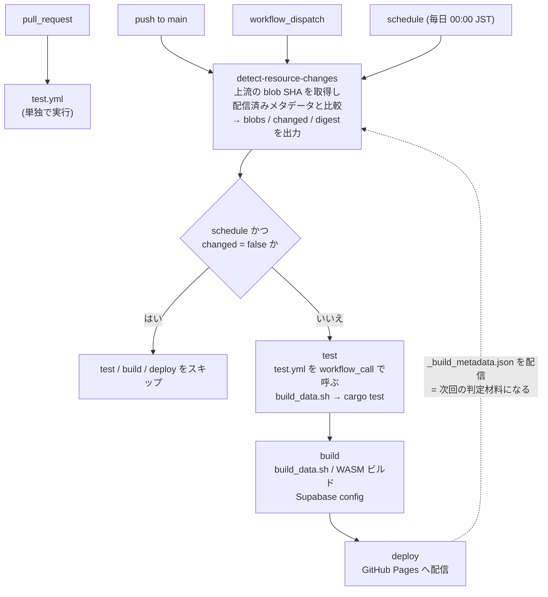
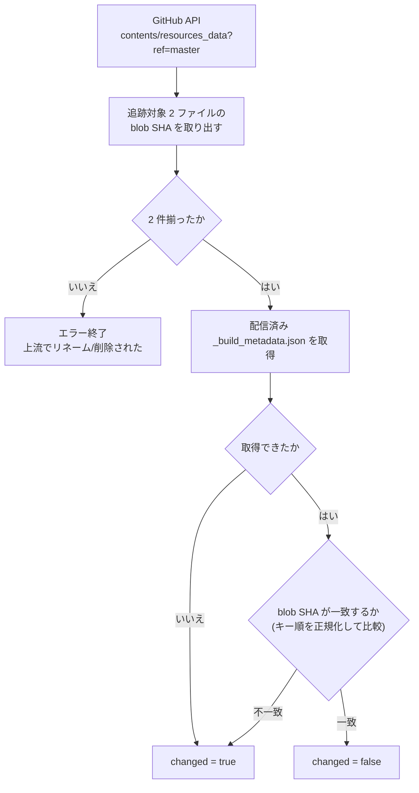
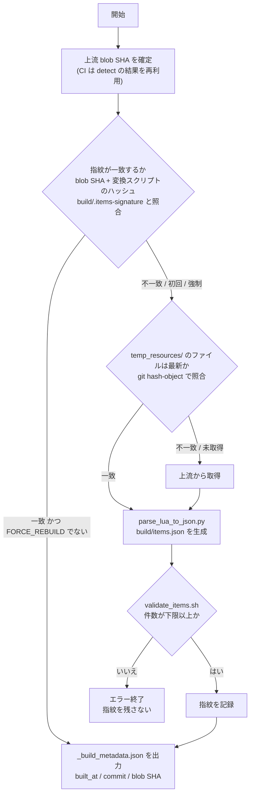

# 0003. 装備データ `items.json` は git 管理せず、CI で上流 Lua から生成する

## Context and Problem Statement

装備検索と装備セット機能には全アイテムのデータが要る。出所は [Windower/Resources](https://github.com/Windower/Resources) が
公開している [`items.lua`](https://github.com/Windower/Resources/blob/master/resources_data/items.lua) 及び [`item_descriptions.lua`](https://github.com/Windower/Resources/blob/master/resources_data/item_descriptions.lua) で、変換後の `items.json` は
1 万数千件・8MB を超える。

重要なのは、**この上流がコミュニティによって継続的にメンテナンスされている**ことである。
FFXI のバージョンアップで装備が追加・変更されるたびに Windower/Resources が更新されるため、
一次データは止まっておらず、こちらが何もしなければ配信するデータだけが古くなっていく。
この巨大な生成物をリポジトリに置くか、置かずに都度生成するかを決める必要がある。

## Decision Drivers

* **上流 (Windower/Resources) が更新されたら、手作業を挟まずその更新を取り込める構成であること** —
  ゲームアップデートのたびに人間が生成・コミットする運用は、忘れた時点で破綻する
* リポジトリのサイズと履歴を汚さないこと（8MB を超えるバイナリ的差分が積み上がるのを避ける）
* サーバーを持たない制約（[ADR 0001](0001-rust-wasm-static-site.md)）の下で配れること
* ローカル開発の手間が過大にならないこと

## Considered Options

1. `items.json` をリポジトリにコミットする
2. CI のビルド時に上流 Lua から生成し、配信成果物にのみ含める（git 管理外）
3. Supabase の `items` テーブルに格納し、クライアントが実行時に取得する

## Decision Outcome

選択: **2. CI のビルド時に生成し、git 管理外とする**（採用）。

`items.json` は加工可能な派生物であって、人間が編集する一次データではない。
一次データは上流の Lua であり、変換スクリプトはリポジトリにある。
したがってリポジトリに保持すべきは「生成方法」であって「生成物」ではない。

以下は、この決定を成立させるために付随して決めたことである。

**生成の入口を 1 つにする**

- 上流ファイルの取得・変換・検証・メタデータ出力は `scripts/build_data.sh` に集約し、
  配信に必要なデータを作る処理を 1 コマンドにする。`.github/workflows/deploy.yml` はこれを呼ぶだけで、
  `web/` 全体を Pages にアップロードする。
- 変換自体は `scripts/parse_lua_to_json.py` が担う。ジョブ・スロット・種族のビットマスクを
  展開し、説明文を結合して JSON 化する。
- 生成物 (`build/` 配下) とダウンロードキャッシュ (`temp_resources/`) は
  `.gitignore` に登録する。`items.json` を `web/` の外に出すのは、ブラウザが
  これを読まなくなったため ([ADR 0010](0010-equipment-interpretation-in-rust.md))。
  `web/data/_build_metadata.json` だけは配信サイト経由で次回の変化判定が読むので
  `web/` に残す。

**上流の更新に自動で追随する**

- `deploy.yml` は `push` に加えて `schedule`（毎日 15:00 UTC = 00:00 JST）と
  `workflow_dispatch` で起動する。上流リポジトリから push 型の通知
  （`repository_dispatch` / webhook）を受け取るには送信側の設定が必要で、
  他人のリポジトリには行えない。polling が唯一の手段である。
- ただし日次フルビルドは無駄が大きい。上流の更新は FFXI のバージョンアップに追随して
  概ね月次であり、実データ変更 1 回あたり約 30 回が空振りになる。そこで
  `detect-resource-changes` ジョブを前段に置き、変化がなければ `schedule` 実行のビルドを
  スキップする。
- 変化の判定には commit SHA ではなく blob SHA（ファイル内容のハッシュ）を使う。
  commit SHA は内容の代理でしかなく、過去日付のコミットを含むブランチが後からマージされた
  場合や、異なる 2 コミットの committer date が同秒だった場合に変化を取りこぼす。
  blob SHA は内容が変わったときだけ変わるため、取りこぼしも、内容不変な no-op コミットによる
  空振りビルドも起きない。日付比較も不要になる。取得はディレクトリ一覧エンドポイント
  (`contents/resources_data?ref=master`) を使い、ファイル内容を転送せずメタデータのみ・
  API 1 回で済ませる。
- 前回ビルド時の blob SHA は `web/data/_build_metadata.json` に記録し、配信サイト経由で
  次回の `detect-resource-changes` が読む。`web/` 配下なので Pages にそのまま公開され、
  外部ストレージを用意せずに状態を持てる。このファイルはビルド全般のメタ情報を入れる器とし、
  blob SHA のほかにビルド時刻と ff11sim 自身の commit も記録する。実データと区別するため
  `_` を前置する。取得に失敗した場合は「変化あり」とみなしてビルドする（安全側に倒す）。

**壊れた生成物を配信しない**

- 定期実行は無人であり、生成物は git 管理外で差分レビューも効かない。上流の構造変更で
  パースが空振りしても変換スクリプトは例外を投げずに「0 件生成して正常終了」しうるため、
  `scripts/validate_items.sh` で件数の下限を検査し、下回れば CI を止める。
- 検査は変換スクリプトに入れず独立させる。`parse_lua_to_json.py` の責務は Lua → JSON の
  変換であり、どの件数を許容するかは上流データの性質ではなく運用ポリシーだからである。
- 具体的な下限値は ADR ではなくスクリプト側に置く。上流の更新で件数は増えていくため、
  ドキュメントに数値を書くと必ず陳腐化する。

**ローカル開発を CI と同じ手順にする**

- チェックアウト直後は `items.json` が存在しないため、`scripts/build_data.sh` を一度
  実行する必要がある。CI と同じコマンドなので手元で配信物をそのまま再現できる。
  `scripts/scrape_augments.py` もこれを前提とする。
- 上流ファイルは `temp_resources/` にキャッシュし、再実行を速くする。GitHub の blob SHA は
  git のオブジェクト ID そのものなので、`git hash-object` でローカルファイルのハッシュを
  計算すれば鮮度を正確に判定でき、一致すればダウンロードを省ける。
- さらに生成物そのものの再作成も省く。生成元の指紋 (上流 blob SHA + 変換スクリプトの
  ハッシュ) を `build/.items-signature` に記録し、一致すれば取得もパースも行わない。
  `FORCE_REBUILD=1` で無効化できる。
- CI は使い捨てランナーなので `temp_resources/` のキャッシュが効かない。
  `actions/cache` で同じ指紋をキーに `build/items.json` を保存・復元する。
  手動実行 (`workflow_dispatch`) では復元せず必ず作り直す。

### ワークフロー全体

`detect-resource-changes` はトリガーによらず必ず走る。`build` がその `blobs` 出力を
メタデータ生成に使うためであり、変化判定はその副産物として得られる。
判定結果を採否に使うのは `schedule` のときだけで、`push` と `workflow_dispatch` は
変化の有無に関わらずビルドする。`deploy` は `needs: build` なので連動して止まる。

検証は `test.yml` に分けてある。`deploy.yml` は `workflow_call` でこれを呼び、
`build` が `needs: test` で受けるため、テストが落ちたら配信に進まない。
PR では `test.yml` が単独で走る (`deploy.yml` は `pull_request` を trigger に
持たないため、PR で配信ワークフローは動かない)。

### 変化判定

前回値の保存先は配信済みサイト自身であり、外部ストレージを使わない。
取得できない場合（初回・Pages 未到達・旧形式）はすべて「変化あり」に倒す。

### build_data.sh

取得・変換・検証・メタデータ出力を 1 コマンドにまとめる。
検証を通らなければ指紋を残さないため、壊れた生成物を「最新」と誤認しない。
メタデータは再生成の有無に関わらず毎回書く (次回の変化判定に使うため)。

生成元が同じなら結果も同じなので、指紋が一致すれば取得もパースも省く。
指紋に変換スクリプトのハッシュを含めるのは、上流が同じでもパース結果が
変わりうるため。

### Consequences

* Good: リポジトリが軽く保たれ、8MB を超える生成物が履歴に蓄積しない。
* Good: デプロイのたびに上流の最新データが反映される。手動の追随作業が要らない。
* Bad: 上流 (Windower/Resources) の URL 変更やフォーマット変更でビルドが壊れる。
  外部リポジトリがビルドの必須依存になっている。
* Bad: ローカル開発では生成が必要で、実行しないと装備検索・装備セットが動かない
  （`scripts/build_data.sh` 一発で済むが、チェックアウト直後は必ず要る）。
* ~~Bad: `web/test/*.test.js` は実際の `items.json` を読む作りのため CI で走らせられない。~~
  → 解消済み。テストは Rust へ移し (docs/adr/0010)、`items.json` は
  `include_str!` で埋め込まれるため `cargo test` で走るようになった。
* Good: `schedule` により、こちらに push がなくても 1 日 1 回は上流の更新が取り込まれる。
  配信データの陳腐化は最大 1 日程度に収まる。
* Bad: 定期実行は無人のため、上流が壊れていても気付かずに配信しうる。件数の下限検査は
  「件数が激減した」ケースしか捕まえず、内容が壊れているが件数は正常というケースは通す。
* Good: 定期実行の大半は `detect-resource-changes` の API 呼び出し 1 回（数秒）で終わり、
  実ビルドは上流が更新された月 1 回程度に収まる。
* Good: `_build_metadata.json` により、配信中のデータがどの上流内容から生成されたかを
  ブラウザから確認できる。`built_at` と合わせて、不具合の報告を受けたときに
  どの時点の・どの内容のデータだったかを特定できる。
* Neutral: 記録するのは blob SHA なので、内容の同一性は厳密に判定できる一方、
  「どのコミット由来か」を人間が GitHub 上で辿るのは容易ではない。
  厳密な変化検出を優先し、コミットレベルの可読性は捨てている。
* Neutral: GitHub は 60 日間アクティビティのないリポジトリの `schedule` を自動停止する。
  開発が長期間止まると定期実行も止まるため、再開時は有効化の確認が要る。
* Neutral: `supabase/schema.sql` の `items` テーブルは「CI でのインポート用」として
  定義されているが、CI はここへインポートしていない。選択肢 3 の検討痕跡であり、
  実際には使われていない。

### Confirmation

* `.gitignore` に `build/` が登録されており、生成物がコミットされない。
* テストは `.github/workflows/test.yml` に分離し、`pull_request` と
  `workflow_call` で走る。`deploy.yml` の `build` ジョブが `needs: test` で
  受けるため、テストが落ちたら配信されない。PR でもマージ前に検証できる。
  なお `cargo fmt --check` と `cargo clippy` は入れていない。既存コードに
  それぞれ 69 件・14 件の指摘があり、入れると変更内容と無関係に落ちるため。
* `.github/workflows/deploy.yml` の "Build data" ステップが
  `scripts/build_data.sh` を実行し、毎回のデプロイで上流取得・変換・検証・
  メタデータ出力を行う。ここで失敗すれば deploy ジョブに進まない。
  ローカルで通しの実行を確認済み: 初回はダウンロードして生成、2 回目は
  `git hash-object` の一致によりダウンロードをスキップ、キャッシュを改変すると
  そのファイルだけ再ダウンロードされること。
* 指紋による再生成スキップも確認済み (4 分岐): 指紋一致でスキップ (1.75s → 0.60s)、
  変換スクリプトを変えると再生成、`FORCE_REBUILD=1` で強制再生成、
  検証に失敗したときは指紋を更新しないこと。
* CI 上でのキャッシュヒットは未確認。`actions/cache` の挙動はローカルで再現できない。
* `deploy.yml` の `on:` に `push` / `schedule` / `workflow_dispatch` の 3 つが設定されており、
  push がなくても定期実行で上流を取り込む。
* `detect-resource-changes` ジョブが `scripts/detect_resource_changes.sh` を実行する。
  判定ロジックはワークフローに直書きせずスクリプトに置き、ローカルでも
  `METADATA_URL=<URL> scripts/detect_resource_changes.sh` で実行して確認できるようにしている
  （進捗ログは stderr、`key=value` は stdout に出す）。
  スクリプトは追跡対象 2 ファイルの blob SHA を GitHub API で取得し、
  配信済みの `_build_metadata.json` の値と比較して `changed` を出力する。
  比較前に両辺をキー順で正規化するため、記録時のキー順に依存しない。
  追跡対象が 2 件見つからない場合（上流でのリネーム・削除）は明示的にエラーで停止する。
  `build` ジョブは `if: github.event_name != 'schedule' || needs.detect-resource-changes.outputs.changed == 'true'`
  で受けるため、`push` と `workflow_dispatch` は従来どおり無条件、
  `schedule` は上流に変化があるときだけ走る。`deploy` は `needs: build` なので連動してスキップされる。
  実 API とローカルで以下を確認済み: blob SHA が 2 件取得できること、一致で `changed=false`、
  片方だけ変化しても `changed=true`、キー順が逆でも正規化により `changed=false`、
  メタデータが 404 の場合と `blobs` を持たない旧形式の場合はいずれも `changed=true` に倒れること、
  追跡対象が欠けた場合と `METADATA_URL` 未指定の場合はいずれも終了コード 1 で止まること。
* `.gitignore` に `web/data/_build_metadata.json` が登録されており、生成物がコミットされない。
* `scripts/validate_items.sh` が生成物の `item_count` を読み、下限を下回ると
  stderr に理由を出して終了コード 1 で停止する。下限の既定値はこのスクリプトが持ち、
  `MIN_ITEMS` で上書きできる。呼び出し元の `build_data.sh` は
  メタデータ出力より前にこれを通すため、検査に落ちたビルドは Pages に到達しない。
  ローカルで以下を確認済み: 下限を下回れば失敗、上回れば通過、境界値ちょうどで通過、
  対象ファイルが無ければ失敗、`MIN_ITEMS` の上書きが効くこと。

検証されていないもの:

* 上流フォーマット変更を検知する仕組みはない（変換スクリプトが例外を投げるか、
  件数が下限を下回った場合のみ止まる）。件数が正常なまま内容だけが
  壊れているケースは通過する。
* `items.json` のスキーマ（各アイテムが必要なフィールドを持つか）は検査していない。
* `parse_lua_to_json.py` 自体の単体テストはない。Python 側にテスト基盤がないため、
  今回は fixture による手動確認にとどめた。

フォローアップ候補: 件数だけでなく内容の健全性（例: `description_en` が空でない
アイテムの割合が一定を下回ったら落とす）まで検査したくなった時点で、`jq` の
ワンライナーではなく `scripts/validate_items.py` などの専用スクリプトに移す
（現在の `scripts/validate_items.sh` は件数チェックのみ）。変換と検証を
分けたまま育てられ、変換スクリプトに検証責務を戻さずに済む。

## Pros and Cons of the Options

### 1. `items.json` をリポジトリにコミットする

* Good: チェックアウトしただけで全機能が動く。ローカル開発の手順が最も少ない。
* Good: 上流が落ちていてもビルドできる。外部依存がない。
* Good: どのバージョンのデータで動いていたかが git 履歴から追える。
* Bad: 8MB を超える生成物がゲームアップデートのたびに履歴へ積み上がる。
  1 回の更新でほぼ全行が変わるため差分圧縮も効きにくい。
* Bad: データ更新のたびに手動で生成・コミットする作業が要る。上流が更新されても、
  誰かが気付いて手を動かすまで反映されない。1 つ目のドライバを正面から満たさず、
  これが最大の却下理由。
* Bad: 一次データ（上流 Lua）と生成物が両方リポジトリ由来になり、どちらが正か曖昧になる。

### 2. CI のビルド時に生成し、git 管理外とする（採用）

* Good: リポジトリが軽く、履歴に生成物が残らない。
* Good: デプロイのたびに上流の最新データが反映され、追随作業が不要。
* Good: 「リポジトリに置くのは生成方法であって生成物ではない」という原則が明確になる。
* Bad: 上流 (Windower/Resources) がビルドの必須依存になる。
  URL 変更やフォーマット変更でデプロイが壊れる。
* Bad: ローカル開発で手動生成が要る。生成しないと装備検索と装備セットが動かない。
* ~~Bad: 生成物が git にないため、それを読むテストを CI に組み込みにくい。~~
  → 解消済み。テストを Rust へ移し、生成物は `include_str!` で埋め込まれるため
  `cargo test` で走る (docs/adr/0010)。
* Bad: どの時点のデータで配信されていたかが、そのままでは追跡できない
  （`_build_metadata.json` を別途出力することで補っている）。

### 3. Supabase の `items` テーブルに格納し、クライアントが実行時に取得する

* Good: データ更新にデプロイが要らない。DB を更新すれば全ユーザーに反映される。
* Good: 必要な行だけ取得でき、全件ダウンロードせずに済む可能性がある。
* Bad: 装備検索が Supabase の可用性に依存する。
  [ADR 0001](0001-rust-wasm-static-site.md) のサーバーレス志向から離れる。
* Bad: インポートのパイプラインを別途作る必要があり、service role key の管理が発生する
  （[ADR 0007](0007-supabase-anon-key-ci-injection.md) で「置かない」と決めた鍵）。
* Bad: 未ログインユーザーにも読ませるため公開 SELECT が要り、RLS の例外が増える。

## More Information

* 全体構成: [ADR 0001](0001-rust-wasm-static-site.md)
* リポジトリ内で管理するテーブルデータとの線引き: [ADR 0002](0002-shared-table-data-json.md)
* 上流に存在しないオーグメントデータの扱い: [ADR 0004](0004-augment-data-managed-separately.md)
* 上流: <https://github.com/Windower/Resources>
